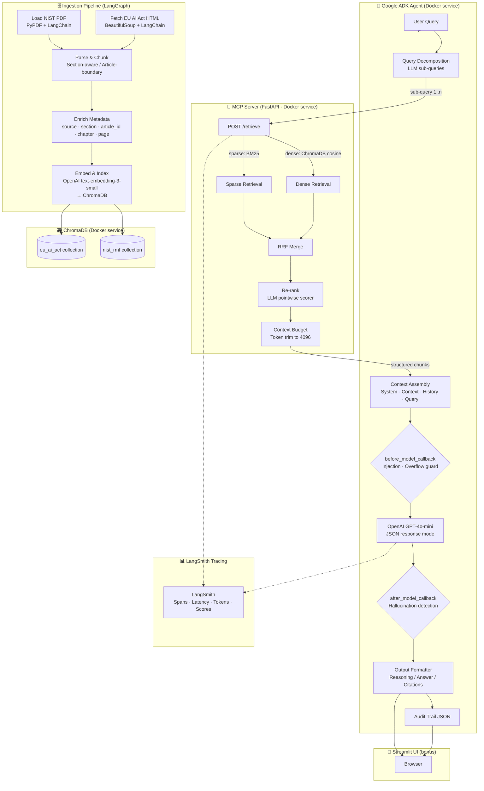

# Agentic RAG Chatbot for Regulatory Documents

> **Enterprise Minds — AI Engineer Take-Home Challenge · March 2026**

A fully-containerised Agentic RAG system that answers questions grounded in two real-world regulatory documents:
- **NIST AI Risk Management Framework** (NIST.AI.100-1) — PDF
- **EU AI Act** (OJ:L_202401689) — Live HTML

---

## Architecture / Workflow Diagram



---

## Quick Start

```bash
git clone https://github.com/c17hawke/EM-take-away-challange-2026.git
cd EM-take-away-challange-2026

cp .env.example .env
# Fill in OPENAI_API_KEY and (optionally) LANGCHAIN_API_KEY

docker-compose up --build
```

Services start in dependency order:
1. `chroma` — ChromaDB vector store (port 8000)
2. `ingestion` — one-shot pipeline that downloads, chunks, embeds, and indexes both documents (exits on success)
3. `mcp-server` — MCP retrieval endpoint (port 8001)
4. `agent-api` — Google ADK agent REST API (port 8002)
5. `ui` — Streamlit chatbot UI (port 8501, bonus)

After ingestion completes, open **http://localhost:8501** for the UI, or query the API directly:

```bash
curl -X POST http://localhost:8002/chat \
  -H "Content-Type: application/json" \
  -d '{"query": "What are the four core functions of the NIST AI RMF?"}'
```

---

## Tech Stack

| Component | Chosen Tool | Justification |
|---|---|---|
| **Agent Framework** | Google ADK (via OpenAI + callbacks) | Lightweight, composable; supports before/after model and tool callbacks natively |
| **Ingestion Orchestration** | LangGraph | Directed graph with named, independently testable nodes; built-in state threading |
| **Document Loading** | LangChain (PyPDFLoader, BeautifulSoup) | Unified loader interface; strong ecosystem for PDF and HTML ingestion |
| **LLM** | OpenAI GPT-4o-mini | Strong instruction-following at low cost; JSON response mode for structured output |
| **Embeddings** | OpenAI text-embedding-3-small | High-quality 1536-dim embeddings; strong on legal/technical English; cost-effective |
| **Vector Store** | ChromaDB | Open-source, Docker-native, cosine-similarity out of the box, no external SaaS needed |
| **Sparse Retrieval** | rank-bm25 (BM25Okapi) | Complements dense retrieval for exact legal terminology (e.g. "Article 13", "GOVERN-1.1") |
| **Hybrid Fusion** | Reciprocal Rank Fusion (RRF) | Proven, parameter-free fusion of dense and sparse ranked lists |
| **MCP Server** | FastAPI | Lightweight, async, auto-generates OpenAPI docs; natural fit for tool endpoints |
| **Tracing** | LangSmith | First-class LangChain integration; captures spans, latency, token counts automatically |
| **Containerisation** | Docker + Docker Compose | Single-command startup; health checks and dependency ordering built in |
| **UI** | Streamlit | Rapid PoC UI; renders Markdown with citation blocks cleanly |
| **Evaluation** | RAGAS | Industry-standard RAG evaluation; faithfulness, answer relevancy, context precision |

---

## Setup Instructions

### Prerequisites
- Docker ≥ 24 and Docker Compose ≥ 2.20
- An OpenAI API key
- (Optional) A LangSmith API key for tracing

### Environment Variables

Copy `.env.example` to `.env` and populate:

| Variable | Required | Description |
|---|---|---|
| `OPENAI_API_KEY` | ✅ | Your OpenAI API key |
| `OPENAI_MODEL` | — | Default: `gpt-4o-mini` |
| `OPENAI_EMBEDDING_MODEL` | — | Default: `text-embedding-3-small` |
| `LANGCHAIN_API_KEY` | Optional | LangSmith API key for tracing |
| `LANGCHAIN_PROJECT` | — | Default: `em-agentic-rag-2026` |
| `MCP_CONTEXT_TOKEN_BUDGET` | — | Default: `4096` |
| `MCP_TOP_K` | — | Default: `10` |

All other variables have sensible defaults for the Docker Compose network.

---

## Ingestion Pipeline Design

### NIST AI RMF (PDF)

- **Loader:** `PyPDFLoader` from LangChain — extracts text page-by-page
- **Cleaning:** Line-level noise filter removes page numbers, running headers, figure/table captions, and the repeated document title
- **Chunking:** `RecursiveCharacterTextSplitter` with `chunk_size=1000`, `chunk_overlap=150`, and structural separators (`\n\n\n`, `\n\n`, `\n`). This respects paragraph and section boundaries
- **Section detection:** Regex pattern matching on the first 500 characters of each chunk identifies the governing NIST function (GOVERN, MAP, MEASURE, MANAGE) or defaults to General
- **Metadata:** `source`, `section`, `page_number`
- **Tables/diagrams:** Text-extractable table content is preserved as-is; purely graphical diagrams are not captured (noted as a known limitation)

### EU AI Act (HTML)

- **Loader:** `requests` + `BeautifulSoup` — strips `<nav>`, `<header>`, `<footer>`, `<script>`, `<style>`, cookie banners
- **Article splitting:** Regex splits the cleaned text at every `Article N` boundary, producing one text block per article
- **Sub-chunking:** Articles longer than `chunk_size` are further split with `RecursiveCharacterTextSplitter`
- **Chapter tracking:** A sequential scan maps each article number to its enclosing chapter
- **Metadata:** `source`, `article_id`, `article_title`, `chapter`

### LangGraph Workflow

```
load_sources → parse_and_chunk → enrich_metadata → embed_and_index
```

Each node logs its progress, and errors are collected in state rather than crashing the pipeline, allowing partial ingestion to succeed.

---

## Context Engineering Design

| Mechanism | Implementation |
|---|---|
| **Context budget** | `apply_context_budget()` enforces a 4096-token ceiling. Chunks are included in relevance order; the last chunk is truncated to fit rather than dropped |
| **Re-ranking** | `rerank_chunks()` sends each chunk snippet to GPT-4o-mini with a 0–10 relevance prompt. Chunks are re-sorted by this score before budget trimming |
| **Structured prompt** | Messages are ordered: `system (instructions)` → `system (retrieved context)` → `conversation history` → `user query`. This separation ensures the model always sees instructions first and context before the question |
| **Memory management** | `summarise_history()` prunes conversation history beyond 6 turn-pairs. Older turns are summarised into a single system message via the LLM, preserving key facts without unbounded context growth |
| **Query decomposition** | `decompose_query()` asks the LLM to split complex/multi-part questions into focused atomic sub-queries. Each sub-query retrieves independently; results are merged and deduplicated by text before re-ranking |

---

## Guardrail Design

| Callback | What it checks | Where it runs | Behaviour |
|---|---|---|---|
| `before_model_callback` | Regex-based prompt injection detection (6 patterns); approximate token overflow (>12 000 tokens) | Before every LLM call | Sanitises matched content in-place; truncates oldest non-system messages on overflow; logs warning |
| `before_tool_callback` | Empty/non-string query; query length >2000 chars; injection patterns in query | Before every MCP tool call | Truncates long queries; raises `ValueError` to block injected queries; logs error |
| `after_model_callback` | EU AI Act article numbers >113 (fabricated); vague attribution phrases; NIST section references absent from citations | After every LLM response | Sets `hallucination_risk=True`; logs warning; UI shows red banner; audit trail records flag |

All guardrail events are propagated to the audit trail via the `guardrail_triggered` and `hallucination_risk` fields.

---

## MCP Server Interface

**Base URL:** `http://mcp-server:8001`

### `POST /retrieve`

```json
{
  "query": "string (required)",
  "top_k": 10,
  "sources": ["nist", "eu_ai_act"],
  "apply_reranking": true,
  "apply_budget": true
}
```

**Response:**
```json
{
  "query": "...",
  "chunks": [
    {
      "text": "...",
      "source": "NIST AI RMF | EU AI Act",
      "article_id": "13",
      "article_title": "Transparency and provision of information to deployers",
      "section": "GOVERN",
      "chapter": "Chapter III",
      "page_number": 42,
      "score": 0.8812,
      "rerank_score": 0.9
    }
  ],
  "total_chunks": 10,
  "latency_ms": 342.1
}
```

Tool schema available at `GET /mcp/schema`.

---

## Required Output Format

Every agent response follows:

### Reasoning / Thinking
Transparent account of query interpretation, sub-queries generated, retrieved context, and reasoning steps.

### Answer
Final grounded response. Contains only claims supported by retrieved context.

### Citations
Structured list: document name, article/section, page number, cited snippet.

---

## Sample Queries & Responses

### Sample 1 — NIST-focused

**Query:** What are the four core functions of the NIST AI RMF?

---

**Reasoning / Thinking**

The query asks directly about the structural organisation of the NIST AI RMF. I decomposed this into one sub-query targeting the NIST collection. The top-retrieved chunks were from the Introduction and GOVERN sections. The four functions are explicitly named and described in the framework overview.

**Answer**

The NIST AI Risk Management Framework is organised around four core functions:
1. **GOVERN** — Establishes organisational culture, policies, processes, and accountability structures for AI risk management across the lifecycle.
2. **MAP** — Identifies and classifies AI risks in context, establishing the risk landscape for a given system.
3. **MEASURE** — Uses qualitative and quantitative methods to analyse, assess, and track AI risks against defined metrics.
4. **MANAGE** — Applies prioritised plans and responses to address identified AI risks, including monitoring and improvement.

**Citations**

1. **NIST AI RMF** — Introduction / Framework Overview, p. 6
   > "The AI RMF Core consists of four functions: GOVERN, MAP, MEASURE, and MANAGE…"

---

### Sample 2 — EU AI Act focused

**Query:** What does Article 13 of the EU AI Act require regarding transparency?

---

**Reasoning / Thinking**

I targeted the EU AI Act collection with the sub-query "Article 13 transparency obligations high-risk AI". Retrieved chunks directly from Article 13. The article is in Chapter III (Requirements for High-Risk AI Systems).

**Answer**

Article 13 of the EU AI Act requires providers of high-risk AI systems to ensure their systems are sufficiently transparent that deployers can interpret outputs and use them appropriately. Specifically it mandates that high-risk AI systems come with instructions for use that include: the identity of the provider, the system's intended purpose, level of accuracy and performance, any known limitations, human oversight measures needed, and expected lifetime and maintenance requirements.

**Citations**

1. **EU AI Act** — Article 13 — Transparency and provision of information to deployers, Chapter III
   > "High-risk AI systems shall be designed and developed in such a way to ensure that their operation is sufficiently transparent to enable deployers to interpret the system's output and use it appropriately…"

---

### Sample 3 — Cross-document

**Query:** How do NIST AI RMF GOVERN requirements relate to EU AI Act transparency obligations?

---

**Reasoning / Thinking**

This is a cross-document question. I decomposed it into: (1) "NIST AI RMF GOVERN transparency documentation requirements" and (2) "EU AI Act transparency obligations high-risk AI Article 13". Retrieved top chunks from both collections. The synthesis compares a voluntary framework against binding law.

**Answer**

Both the NIST AI RMF GOVERN function and EU AI Act Article 13 converge on transparency as a core pillar, but differ in nature and enforcement. NIST GOVERN asks organisations to define policies for transparency, documentation, and accountability as voluntary organisational practice. EU AI Act Article 13 creates binding legal obligations for providers of high-risk AI to provide specific technical documentation and instructions for use enabling deployers to understand system output. In practice, an organisation using the NIST framework as a baseline would find that GOVERN-aligned transparency practices — clear documentation, accountability chains, and explainability — map closely to what Article 13 legally mandates, making NIST a useful implementation guide for EU AI Act compliance.

**Citations**

1. **NIST AI RMF** — GOVERN, p. 20
   > "GOVERN policies, processes, procedures, and practices are in place, transparent, and implemented effectively…"
2. **EU AI Act** — Article 13 — Transparency and provision of information to deployers, Chapter III
   > "High-risk AI systems shall be designed and developed in such a way to ensure that their operation is sufficiently transparent…"

---

## Tracing & Observability

Tracing is instrumented via **LangSmith**. Set `LANGCHAIN_API_KEY` in `.env` to enable.

Every pipeline step creates a named span:
- `ingestion.load_sources`
- `ingestion.parse_and_chunk`
- `ingestion.embed_and_index`
- `mcp.retrieve` (latency, chunk count, scores)
- `agent.decompose_query`
- `agent.llm_call` (token count, model name)
- `agent.rerank`
- `guardrail.before_model` / `guardrail.before_tool` / `guardrail.after_model`

Captured metrics per trace:
- Latency per step (ms)
- Token count per LLM call
- Retrieval score and chunk count
- Guardrail trigger events
- Hallucination flag
- Grounding score

> **Tracing evidence:** Screenshots and trace links will be added to `tracing_screenshots/` after the first live run. Configure `LANGCHAIN_API_KEY` in `.env` to enable LangSmith tracing.

---

## Evaluation Results

Run the evaluation suite against a live stack:

```bash
docker-compose run --rm agent-api python -m evaluation.evaluate
```

Results are written to `evaluation/results.json` and `evaluation/report.md`.

**Test questions:** 8 total — 6 single-document, 2 cross-document  
**Metrics:** Faithfulness, Answer Relevancy, Context Precision (RAGAS)

See [evaluation/report.md](evaluation/report.md) for the full report after running.

---

## Known Limitations & Future Work

| Limitation | Future Mitigation |
|---|---|
| PDF table extraction is imperfect for complex layouts | Use Unstructured.io or LlamaParse for richer PDF parsing |
| EU AI Act Annexes are not separately indexed | Ingest Annexes as their own collection with cross-reference metadata |
| Re-ranking uses an LLM judge (adds latency + cost) | Replace with a bi-encoder cross-encoder (e.g. cross-encoder/ms-marco-MiniLM) |
| BM25 index is rebuilt in-memory on every MCP server start | Persist BM25 index to disk or use Elasticsearch for production |
| Session memory is in-process (lost on restart) | Use Redis or a persistent session store |
| Hallucination detection is pattern-based | Integrate a dedicated NLI-based faithfulness checker |
| No CI/CD pipeline | Add GitHub Actions workflow for lint, type-check, and evaluation smoke tests |

---

## Project Structure

```
.
├── config.py                  # Centralised environment config
├── ingestion/
│   ├── nist_loader.py         # Task 1 — PDF ingestion
│   ├── eu_ai_act_loader.py    # Task 2 — HTML ingestion
│   ├── vector_store.py        # Task 3 — ChromaDB + hybrid retrieval
│   ├── workflow.py            # Task 4 — LangGraph pipeline
│   └── main.py                # Ingestion entrypoint
├── mcp_server/
│   ├── server.py              # Task 5 — MCP retrieval endpoint
│   └── context_engineering.py # Task 6 — Budget, rerank, decompose, memory
├── agent/
│   ├── adk_agent.py           # Task 7 — Google ADK agent
│   ├── callbacks.py           # Task 7 — Before/after model + tool callbacks
│   ├── output_formatter.py    # Tasks 8 & 9 — Response format + audit trail
│   └── api.py                 # Agent REST API
├── evaluation/
│   ├── evaluate.py            # Task 11 — RAGAS evaluation suite
│   ├── results.json           # Auto-generated evaluation results
│   └── report.md              # Auto-generated evaluation report
├── ui/
│   └── app.py                 # Bonus — Streamlit chatbot UI
├── Dockerfile                 # Multi-stage build for all services
├── docker-compose.yml         # Full stack orchestration
├── requirements.txt
├── .env.example
└── README.md
```